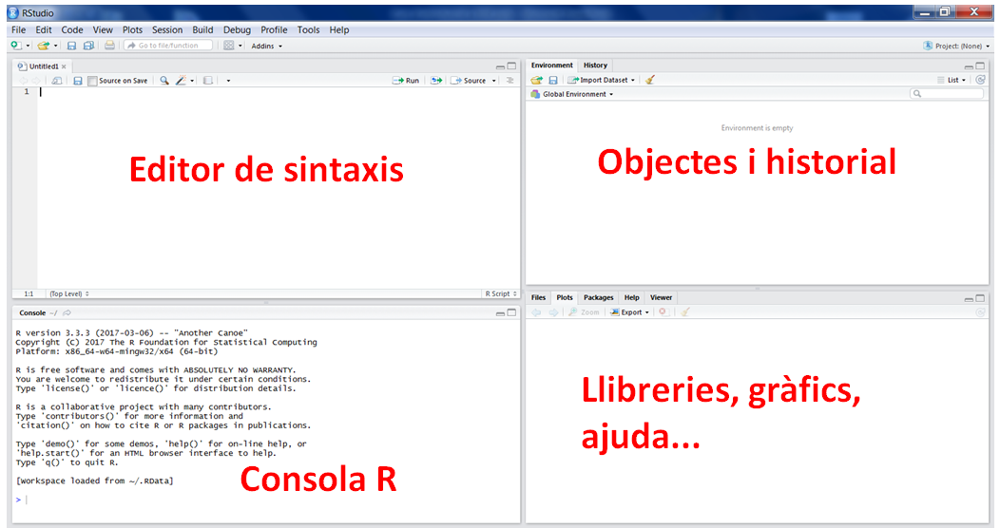
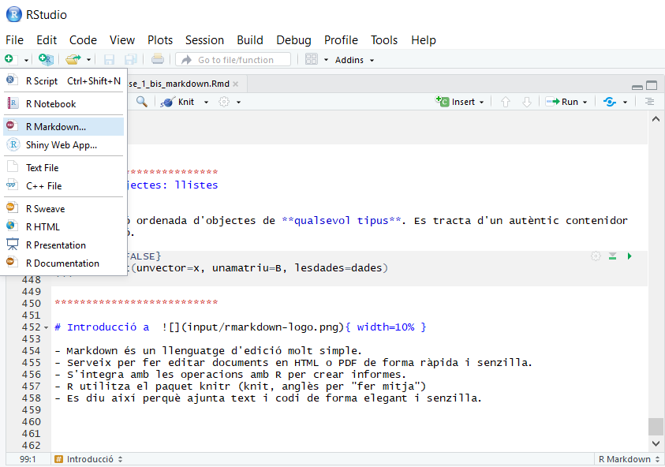

```{r setup, include=FALSE}
knitr::opts_chunk$set(echo = TRUE)
```

# Instal·lació d'R

R és un llenguatge de programació, però s'instal·la a l'ordinador com qualsevol altre programa.
El podeu trobar a:

> https://cran.r-project.org/

On trobareu versions per linux, mac i windows. 

Baixeu-vos l'última versió disponible, que en el moment d'escriure aquest text és la 3.6.0.

Seguiu després les instruccions per instal·lar-lo al vostre ordinador. 

# Instal·lació d'RStudio

Una vegada instal·lat R ja el podem utilitzar, el que passa és que és difícil d'utilitzar com a tal, i per això fem servir un IDE (Entorn integrat de desenvolupament (en anlgès)), que bàsicament ens facilita la vida a l'hora de programar

L'IDE més utilitzat per R és RStudio, i és el que nosaltres utilitzarem. El podeu trobar a:

**mac**: https://medium.com/@GalarnykMichael/install-r-and-rstudio-on-mac-e911606ce4f4

**Windows**: https://medium.com/@GalarnykMichael/install-r-and-rstudio-on-windows-5f503f708027

**LINUX**: https://medium.com/@GalarnykMichael/install-r-and-rstudio-on-ubuntu-12-04-14-04-16-04-b6b3107f7779

Seguiu també les instruccions per instal·lar-lo.

## { width=7% } Studio



# Paquets i les llibreries

L'R base, que ens hem descarregat, té una sèrie de funcions, però aquestes es complementen amb moltes d'altres que han desenvolupat tercers i que necessitarem pels nostres anàlisis. Aquestes llibreries s'han d'instal·lar a part, i, a més s'han de carregar en cada sessió que les fem servir. 

Per instal·lar-les utilitzem la funció install.packages: 

```{r , eval=FALSE}
install.packages("foreign") #llegir Stata,SPSS...
```

Això només ho hem de fer una vegada en cada ordinador (o quan actualitzem l'R).

Un cop instal·lat l'haurem de carregar a la biblioteca:

```{r , eval=FALSE}
require(foreign) #library(foreign)
```

Hem de tenir en compte que el require l'haurem de fer en cada sessió que vulguem utilitzar la funció, inclosa la sessió del markdown. Per tant, no ens hem d'oblidar d'afegir el requiriment de cada paquet també dins del Markdown (normalment al principi de tot, per tenir-les controlades).

Si volem saber-ne més d'un paquet podem fer:

```{r , eval=FALSE}
require(help="foreign") # o
??foreign
```

O simplement buscar-ho al google.


# Què és el Markdown?

## Introducció a { width=10% }

- Markdown és un llenguatge d'edició molt simple.
- Serveix per fer editar documents en HTML o PDF de forma ràpida i senzilla.
- S'integra amb les operacions amb R per crear informes.
- R utilitza el paquet knitr (knit, anglès per "fer mitja")
- Es diu així perquè ajunta text i codi de forma elegant i senzilla.
- És reproduïble: si d'aquí 6 mesos voleu repetir l'informe, només cal apretar un botó!



# Utilització del Markdown

Aquí puc escriure el que vulgui, s'imprimirà com a text normal.

```{r}
# Aquí dins només puc escriure com si estés programant, si no em donarà error
x = rnorm(10000)
a = sin(pi*x)
```

Aquí puc tornar a escriure normal. Fins i tot puc fer coses com **negreta** o *cursiva*.

```{r}
# Puc fer que imprimeixi resultats
liver = read.csv('input/indian_liver_patient.csv')
summary(liver)
```

També puc afegir plots:
```{r}
# o que tregui gràfics fets amb les dades:
plot(x, a)
```

Puc fer llistes:

* Un
* Dos
* Tres

I enumeracions:

1. Primer
1. Segon
1. Tercer  (sí, no m'he equivocat, el númeor del principi ha de ser sempre 1...)

I fins i tot puc fer fórmues en làtex:

\[ \sum\limits_{n=1}^{\infty} 2^{-n} = 1 \]

També puc posar links de manera molt fàcil:

[Exemple](www.urv.cat)

I per acabar, també puc incloure imatges (evidentment, les imatges a les que fan referència han d'estar a la mateixa carpeta que el fitxer de markdown):


# Espais de treball

Per tal de fer servir Markdown de forma eficient hem d'entendre què són els espais de treball i la relació entre el del Markdown i el local. Ho expliquem a continuació:

## Espai local

L’espai de treball és el lloc de l’ordinador on treballa R; això vol dir dues coses:

La carpeta on estem treballant i on podem accedir a altres fitxers (csv, excels, spss, etc).
Les variables que hem creat (i que veiem dalt a la dreta de l’Rstudio).

Per tal de poder treballar amb fitxers externs hem de posar el nostre espai de treball a la mateixa carpeta on tinguem els fitxers. Podem veure l’espai de treball on estem ara corrent getwd() a la consola o directament ho veiem sota la paraula “Console”, en gris. Si no estem a la carpeta que volem ho hem de canviar amb:

setwd(“ruta”) (* Recorda que això no es pot posar al markdown, només a la consola per fer-ho en local!*)

## Espai del markdown

El markdown té un altre espai de treball, que és aquell on es troba el fitxer. Per tant, la recomanació és que poseu els fitxers externs a la mateixa carpeta que el markdown i que en cap cas poseu rutes dins del markdown.

Penseu que els dos espais de treball són independents, per tant tot el que feu en local (requerir paquets, crear objectes, etc.) també ho heu de fer en el markdown!

Per altra banda, quan esteu corrent codi que està dins del markdown, però NO esteu fent “knit”, això es corre el local, NO en el markdown! L’espai de treball del markdown només s’utilitza quan compilem (li donem a “knit”).

## Espai de treball eteri

Si obriu el markdown, treballeu, i després moveu el fitxer els espais de treball són complicats de seguir, per tant recomanem que no ho feu mai. Tampoc treballeu mai dins d’un fitxer zip, ja que no podreu fer-hi res. Assegureu-vos d’extreure-ho tot abans de començar a fer res.

## Coses que **no** es poden posar al markdown

```{r, eval = F}
setwd("RUTA") # això s'ha de posar a la consola per estar a l'espai de treball que toca, però NO dins del markdown. L'espai de treball del markdown és el lloc on es troba el fitxer, per tant, l'únic que hem de fer és posar els arxius que necessitem a la matiexa carpeta que el fitxer .Rmd

View(dades) # això tmabé ho fem en local però no en el markdown perquè el més probable és que em doni un error

install.packages("paquet") # això també ho fem a la consola però no al markdown (el library(paquet) o require(paquet) sí que l'hem de posar!)

dades # això no donarà un error però imprimirà pàgines i pàgines de dades que no cal.
#

read.csv("dades_prova.csv") # això només carrega el fitxer i l'imprimeix en pantalla, però no el guarda!
```