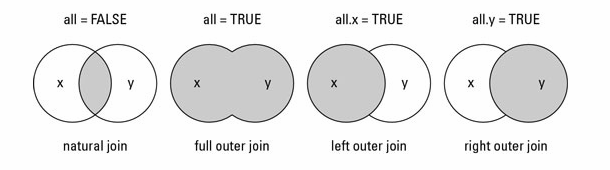

```{r setup, include=FALSE}
knitr::opts_chunk$set(echo = TRUE)
set.seed(1)
```

# Introducció

En aquesta classe veurem com manipular dataframes per tenir-los exactament com els necessitem per fer els anàlisis i els gràfics. En concret, aprendrem a separar i ajuntar dataframes, així com de posar-los en el que s'anomena format llarg i format ample. 

## Separar dataframes

Sovint necessitarem només troços de cada base de dades per fer cada anàlisi; en aquests casos pot ser convenient extreure només una part del dataframe.

Una forma simple és fer una subselecció com les que ja hem vist. Per exemple, en el dataset indian_liver_patient:

```{r}
df = read.csv('input/indian_liver_patient.csv')
df_reduit = df[, -c(10,11)]
```

I, si volem triar observacions segons algun criteri:

```{r}
df_reduit = df[df$Age>65, -c(10,11)]
```

També es pot fer servir la funció select:

```{r}
df_reduit = subset(df, select = 1:9)
```

I, si volem triar observacions segons algun criteri:

```{r}
df_reduit = subset(df, subset = df$Age>65, select = 1:9)
```

## Ajuntar dataframes

## cbind.data.frame i rbind.data.frame

Aquestes són dues funcions simples que utilitzarem per ajuntar dataframes o vectors de la mateixa llargada i que vulguem en el mateix ordre. 

Per exemple, imagineu que volem fer un vector amb noms de variables, p-valors, p-valors ajustats i odd ratios per tal de poder-lo ensenyar. Ho faríem de la següent manera (amb totes les dades simulades):

```{r}
noms = paste0(rep("Var", 8), seq(1, 8, by=1))
pvals = rpois(8, 4)/100
pvals_adj = p.adjust(pvals, method = "BH")
odd_ratio = rnorm(8, 1.1, sd = .1)

tot = cbind.data.frame(noms, pvals, pvals_adj, odd_ratio)
```

```{r}
require(knitr)
kable(tot)
```

I operarem de forma similar amb rbind.dataframe (per exemple si volem ajuntar dades antigues amb noves dades amb exactament el mateix format).

Per fer-ho utilitzarem la funció merge. Ho fem amb els següents tres fitxers, que ens passen de forma separada i volem ajuntar per analitzar:

```{r}
df1 = read.csv('input/per_ajuntar_1.csv')
df2 = read.csv('input/per_ajuntar_2.csv')
df3 = read.csv('input/per_ajuntar_3.csv')
head(df1)
head(df2)
head(df3)
```

Fixem-nos que hi ha dos tipus d'identificadors, l'ID, que és únic de cada pacient, i després N_BIOBANC, que és únic per cada observació. Es pot donar, però, que un mateix pacient tingui dos biobancs, i haurem de mirar què fer amb això.

Explorem abans que res la funció merge:

## Funció merge

```{r, eval=F}
merge(x, y, by = intersect(names(x), names(y)),
      by.x = by, by.y = by, all = FALSE, all.x = all, all.y = all,
      sort = TRUE, suffixes = c(".x",".y"), no.dups = TRUE,
      incomparables = NULL, ...)
```

Anem per parts: 

**x, y**: són els dataframes a ajuntar.

**by, by.x, by.y**: són les claus amb les quals ajuntar-les, és a dir, els noms de les columnes que sabem que tenen la mateixa informació i que ens permeten associar els dos fitxers. Per exemple, en el nostre cas, serien ID i N_BIOBANC. A partir d'aquí tenim dues opcions, si el nom és el mateix en els dos fitxers, podem no posar res i ell per defecte ja els ajuntarà correctement, o podem explicitar-ho afegint *by = "ID"*, per exemple. En el cas de que les dues variables es diguin diferent, haurem d'explicitar-ho utilitzant el *by.x* i el *by.y*, per exemple posant *by.x = "ID", by.y = "Altre_ID"*.

**all, all.x, all.y**: aquests paràmetres controlen el tipus de merge que farem. *all* vol dir que agafarem totes les entrades, encara que no tinguin correspondència entre fitxers. En els casos que no hi hagi correspondència, posarem missings. Això és el que s'anomena un "outer join". *all.x* i *all.y* imposen que importem totes les observacions dels fitxers x i y respectivament encara que no tinguin correspondència. S'anomenen "left join" i "right join". Per defecte, si no posem res, merge fa un "natural (o inner) join", és a dir, només manté les observacions que es troben en els dos fitxers (i que normalment és el que ens interessa).

En el següent gràfic podem visualitzar aquestes idees:



Ho fem a la pràctica:

## Exemple

Ajuntem df1 i df2:

```{r}
df12 = merge(df1, df2)
head(df12)
```

Ajuntem df12 i df3:

```{r}
df = merge(df12, df3)  # Això no és correcte, alerta!

df = merge(df12, df3, by.x = c("ID", "N_BIOBANC"), by.y = c("ID", "biobanc"))  # Això sí
head(df)
```

# Canvis de format

Ara volem canviar dades que estaven en columnes a una sola columna o al revés. Per exemple, imagineu que tenim un experiment en el qual prenem mesures abans i després de prendre un medicament. Normalment, a l'hora de guardar les dades, creem una columna per cada moment de prendre les dades. Això, però, no ens permet fer regressions o models mixtes en R, així que les haurem de posar en una mateixa columna.

Per fer aquestes operacions utilitzarem el paquet reshape2 i les funcions melt, dcast i reshape, que és una generalització de les dues.

Treballarem amb les següents dades:

```{r}
require(reshape2)
df = read.csv('input/dades_reshape.csv')
df$edat = round(df$edat)
head(df)
```

Veiem que tenim moltes variables glu; això és perquè estem treballant amb una corba de la glucosa. Per tal de poder fer models amb aquestes dades, necessitem que estiguin en una mateixa columna. 

Això ho farem amb la funció melt:

## Melt

```{r, eval=F}
melt(data, id.vars, measure.vars,
  variable.name = "variable", ..., na.rm = FALSE, value.name = "value",
  factorsAsStrings = TRUE)
```

Per parts: 

**data**: el dataframe que volem canviar.
**id.vars**: les variables que s'utilitzen per identificar cada pacient o observació, és a dir, aquelles que són fixes en diferents punts del temps (en el nostre cas, ID, grup i edat).
**measure.vars**: aquestes són les variables de mesura, i per tant les que sí que canvien durant el temps. En el nostre cas totes les que comencen per glucosa.
**value.name**: li podem donar un nom a la variable que crearà, per exemple en el nostre cas una bona opció podria ser "glucosa".

Ho fem:

```{r}
dfm = melt(df, id.vars = c("ID", "grup", "edat"), measure.vars = 4:8, value.name = "glucosa")
head(dfm)
```

```{r}
require(lattice)
xyplot(glucosa ~ variable | ID, 
       data=dfm, 
       group = grup, 
       auto.key=T,
       scales=list(x=list(rot=45)),
       pch = 20,
       cex = 1.5,
      title = "Glucosa pre i post")

model = glm(grup~ variable:glucosa + edat, dfm, family = "binomial")
summary(model)
```

## dcast

dcast és l'invers de melt, i el farem per convertir dades en columnes cap a files.

*Per recordar-ho:* melt és el procés de fondre el metall per tal de crear nous objectes (cast). 


```{r, eval=F}
dcast(data, formula, fun.aggregate = NULL, ..., margins = NULL,
  subset = NULL, fill = NULL, drop = TRUE,
  value.var = guess_value(data))
```

Per parts: 

**data**: el dataframe que volem canviar.
**formula**: serà la fórmula que ens permetrà especificar quines variables depenen de quines i per tant com s'han de canviar. Bàsicament hem de posar totes les variables que ens interessin en funció d'aquella que vulguem separar (en el nostre cas el grup). 

Refem doncs el canvi que havíem fet amb melt:

```{r}
dfc = dcast(dfm, ID + grup + edat ~ variable, value.var = "glucosa")
head(dfc)
```

Ara imaginem que volem posar el pre i el post en columnes diferents, això ho fem amb la funció dcast (que és simplement la funció cast per dataframes):

```{r}
dfc2 = dcast(dfm, ID + edat + variable ~ grup, value.var = "glucosa")
head(dfc2)
```

Ara per exemple podem calcular fàcilment la diferència i dibuixar-la:

```{r}
dfc2$diferencia = dfc2$Post - dfc2$Pre
xyplot(diferencia ~ variable | ID, 
       data=dfc2, 
       auto.key=T,
       scales=list(x=list(rot=45)),
       pch = 20,
       cex = 1.5,
      title = "Diferència per pacient")
```

Per acabar, tenim la funció reshape, que inclou les dues:

## reshape

```{r, eval=F}
reshape(data, varying = NULL, v.names = NULL, timevar = "time",
        idvar = "id", ids = 1:NROW(data),
        times = seq_along(varying[[1]]),
        drop = NULL, direction, new.row.names = NULL,
        sep = ".",
        split = if (sep == "") {
            list(regexp = "[A-Za-z][0-9]", include = TRUE)
        } else {
            list(regexp = sep, include = FALSE, fixed = TRUE)}
        )
```

Anem per parts: 

**data**: és el dataframe que volem reformatejar.

**varying**: noms de les variables en el format ample que corresponen a una sola variable en el format llarg (per exemple les diferents glucoses que teníem al principi, una en cada columna).
**v.names**: noms de les variables en format llarg que volem posar en columnes separades. Essencialment, les variables que ens interessen (la que abans hem anomenat "glucosa").
**timevar**: nom de la variable en el format llarg que identifica les diferents variables en el format ample (per exemple, una vegada hem fet melt, la variable anomenada "variable", que identificava els diferents moments de presa de glucosa).
**idval**: noms de les variables en el format llarg que identifiquen un mateix pacient. És a dir, aquelles que són constants. En el nostre cas: ID i edat.
**direction**: cap a quina direccio hem de transformar: "long" per fer el mateix que fa melt i "wide" per fer el mateix que fa cast.

Fem doncs el mateix que hem fet abans amb el melt i el cast però utilitzant només el reshape:

```{r}
dfm = reshape(df, varying = 4:8, times = names(df)[4:8], v.names = "glucosa", direction = "long")
dfm$id = NULL
head(dfm)
```

I si volem tornar enrera:

```{r}
dfc = reshape(dfm, timevar = "time", idvar = c("ID", "grup", "edat"), direction = "wide")
head(dfc)
```

Veiem que els noms queden una mica estranys, però això es pot arreglar, per exemple fent:

```{r}
names(dfc)[4:8] = gsub(names(dfc)[4:8], pattern = "glucosa.glucosa", replacement = "glucosa")
head(dfc)
```

