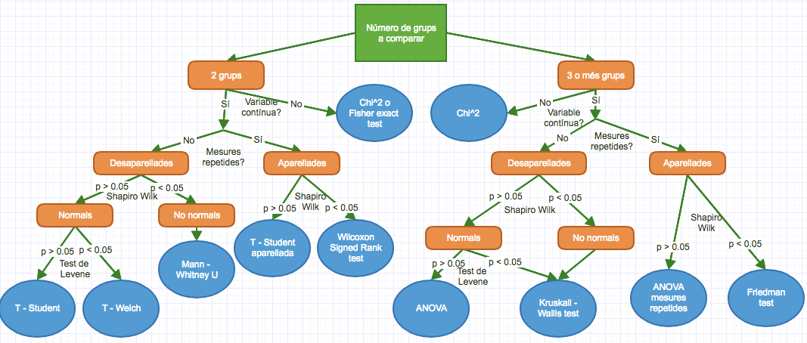

```{r setup, include=FALSE}
knitr::opts_chunk$set(echo = TRUE)
```





Test | Comanda 1 | Comanda 2
-------------------- | ---------------------- | ---------------------
Chi 2 | chisq.test(x, y) | 
Fisher exact test | fisher.test(x, y) | 
Shapiro Wilk | shapiro.test(x) |
Levene | var.test(x, y) | levene.test(y, group) 
T - Student | t.test(x, y, var.equal = TRUE) | t.test(formula, data, var.equal = TRUE)
T - Welch | t.test(x, y) | t.test(formula, data)
Mann-Whitney U | wilcox.test(x, y) | wilcox.test(formula, data)
T - Welch aparellada | t.test(x, y, paired = TRUE) | t.test(formula, data, paired = TRUE)
Wilcoxon Signed Rank | wilcox.test(x, y, paired = TRUE) | wilcox.test(formula, data, paired = TRUE)
ANOVA | aov(formula, data) |
Kruskall Wallis | kruskal.test(x, g) | kruskal.test(formula, data)
ANOVA mesures repetides | ez::ezANOVA(data, dv, wid) |
Friedman | friedman.test(y, groups) | friedman.test(formula, data)